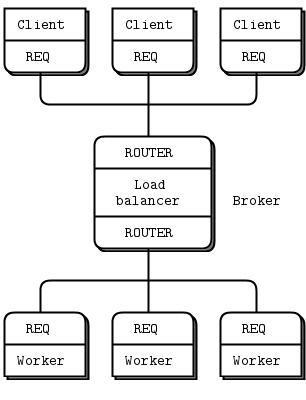

# M1
Node et communication inter-node

---

## Objectif

Cette maquette permettra d'isoler les échanges entre les differents noeuds.
Afin de réussir l'objectif nous allons décomposer en plusieurs maquettes :

>**Remarque : **
> Après plusieurs tentatives infructueuses je suis parti sur une autre architecture qui est expliqué par [le guide ZéroMq](https://zguide.zeromq.org/)

### M1-P1 

#### Exerecice

Permettre de composer un bus de données (Broker) et de connecter un ou plusieurs clients et un ou plusieurs workers 
2 services seront proposés *print* et *afficher*   

:construction:

#### Algo 

Postulats
- Afin de simplifier la gestion j'utilise le protocole IPC
- 1 worker est spécialisé pour rendre un seul service

Etapes
1. Démarrage du noeud
2. Démarrage des workers
3. Démarrages des clients (pour l'exercice)
4. Communication entre les clients et les workers par l'entremise du noeud

cas particulier : 
- à la base le noeud ne démarre pas de client habituellement 

Questions en suspens :
- qui diffuse aux autres le nouveau noeud arrivé ? (decision : le nouvel arrivé /!\ Décision non pérenne dans le temps)
- la durée de vie d'une instance du client sur le serveur est-il permanent ou temporaire (le temps d'un req/rep) ?
- Comment faire la maintenance de la table ?

#### Architecture

:

#### Difficultés rencontrées
03/04/2022 - it's work !! mais pas top 
27/05/2022 - Changement complet d'architecture + robuste 

---

### M1-P2 

#### Exerecice

Spécialisation des services par noeud. Cela ce traduit pas le noeud 1 avec uniquement le service *print* et le noeud 2 avec le service *afficher*
Donc un client *afficher* sur le noeud 1 doit pouvoir avoir son service rendu grâce au noeud 2. 

:warning: (à faire) :warning:

---

### M1-P3 

#### Exerecice

Permettre de connecter plusieurs noeuds ensembles et d'échanger des messages de façon aléatoire et sans cadence fixe.
par contre l'échange se fait entre deux zones différentes qui communique avec des routeurs. Comme la communication entre 2 sous réseaux IP

:warning: (à faire) :warning:
