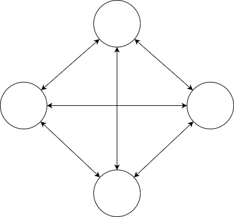

# M1
Node et communication inter-node

---

## Objectif

Cette maquette permettra d'isoler les échanges entre les differents noeuds.
Afin de réussir l'objectif nous allons décomposer en plusieurs maquettes :

### M1-P1 

#### Exerecice

Permettre de connecter plusieurs noeuds ensembles et d'échanger des messages de façon aléatoire et sans cadence fixe.
par contre l'échange se fait en one to one

par exemple : 

:

#### Algo 

Postulats
- Afin de simplifier la gestion des firewalls je n'utilise qu'un seul port d'écoute pour l'exercice.
- Ensuite la découverte est aidée au démarrage par l'indication d'un noeud déjà opérationnel.
- Un noeud contient une table avec tous les noeuds existants 

Etapes
1. Démarrage du noeud
2. tentative de connexion au noeud entré en paramètre (échec = arrêt du noeud) (q/r = ping / pong)
3. envoie du nom, de l'@ et du port du noeud
4. reception de la table contenant les autres noeuds
5. le noeud envoie son nom son @ et son port aux autres noeuds (_question : le faire avec le nouveau noeud
ou le faire avec l'autre ?_)
6. début de l'échange de message avec les autres

cas particulier : 
- un noeud seul attend un autre pour commencer

Questions en suspens :
- qui diffuse aux autres le nouveau noeud arrivé ? (decision : le nouvel arrivé /!\ Décision non pérenne dans le temps)
- la durée de vie d'une instance du client sur le serveur est-il permanent ou temporaire (le temps d'un req/rep) ?
- Comment faire la maintenance de la table ?

#### Architecture

:construction: 

:warning: (à faire) :warning:

#### Difficultés rencontrées
17/03/2022 - pour le moment ma difficulté est simple à comprendre et compliqué à résoudre (pour moi :sweat_smile:) .
le principe que j'ai opté (car pour le moment ~~je n'en vois pas d'autres~~ je n'arrive pas en faire d'autres) c'est un "serveur" composé d'une partie serveur permanent et une partie client qui s'instancie seulement pour une communication.
Donc j'ai un cycle comme ça pour l'exercice : j'écoute pendant un certain temps, **puis** j'envoie et j'attends la réponse pendant un certain temps. Hors dès que je mets deux serveurs à s'exécuter ils passent plus de temps à parler qu'à s'écouter. Cela donne que le message est quand même capté, mais jamais la réponse ne l'est.
Ensuite, j'ai encapsulé en thread la partie client, mais là pas mieux c'est revenu à faire du deadlock chacun tentait d'envoyer son message sans écouter. 
01/04/2022 - Actuellement je pars sur la solution d'un ordonnanceur (thread différent) qui envoie les questions-réponses de la partie client... en cours
03/04/2022 - it's work !!

### M1-P2 

#### Exerecice

Permettre de connecter plusieurs noeuds ensembles et d'échanger des messages de façon aléatoire et sans cadence fixe.
par contre l'échange se fait chainer

:warning: (à faire) :warning:

### M1-P3 

#### Exerecice

Permettre de connecter plusieurs noeuds ensembles et d'échanger des messages de façon aléatoire et sans cadence fixe.
par contre l'échange se fait entre deux zones différentes qui communique avec des routeurs. Comme la communication entre 2 sous réseaux IP

:warning: (à faire) :warning:
